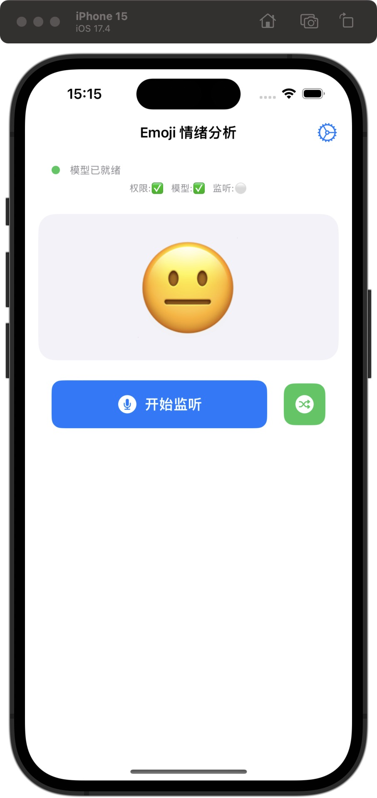

# 🎭 iOS Emoji Transform

> 实时语音情绪识别 → Emoji 转换，部署于 iOS 设备

<p align="center">
  
  
  
  
</p>

## 📸 演示效果

<p align="center">
  
  
</p>

## ✨ 功能特点

- 🎤 **实时语音情绪识别** - 配合 Speech Framework 实现
- ⚡ **低延迟推理** - Neural Engine 加速，<50ms 响应
- 📱 **轻量部署** - INT8 量化模型仅 98MB
- 🎯 **17种情绪** - 覆盖常用表情场景

## 🎭 支持的 Emoji

| 😂 大笑 | 😄 开心 | 🥹 感动 | 😅 尴尬 | 😁 得意 |
|:---:|:---:|:---:|:---:|:---:|
| 🤓 认真 | 🥲 苦笑 | 😎 酷 | 🧐 疑惑 | 😱 惊恐 |
| 😡 愤怒 | 🫡 致敬 | 🥰 喜爱 | 😨 害怕 | 😠 生气 |
| 😑 无语 | 😭 大哭 | | | |

## 📁 项目结构

```
├── IOS_emoji_analyser/        # iOS App 源代码
├── IOS_emoji_analyser.xcodeproj
├── emotion_recognition/       # 模型训练代码
│   ├── train.py              # 训练脚本
│   ├── config.py             # 配置文件
│   ├── dataset/              # 训练数据集
│   ├── output/               # 导出配置文件
│   ├── ios_integration/      # Swift 集成示例代码
│   └── assets/               # 演示图片
└── README.md
```

## 🚀 快速开始

### iOS App
1. 用 Xcode 打开 `IOS_emoji_analyser.xcodeproj`
2. 下载模型文件（见下方说明）
3. 配置签名后运行

### 训练环境

操作系统 Ubuntu
GPU RTX 4090
python 3.x
pytorch 2.9.1+cu128
transformers HuggingFace
CUDA 12.8

### 模型训练

```bash
cd emotion_recognition
pip install -r requirements.txt
python train.py
```

### 命令行测试
```bash
python test_realtime.py
```
模拟口语环境，识别10秒缓存区中最多20个字

## 📥 模型下载

由于模型文件较大（98MB），未包含在仓库中。请自行训练或联系获取：
- `EmojiPredictor_int8.mlpackage` - CoreML INT8 量化模型
- 将模型文件添加到 Xcode 项目中

## �� 模型信息

| 项目 | 详情 |
|------|------|
| 基座模型 | bert-base-chinese (102M) |
| 量化方式 | INT8 |
| 模型大小 | 98 MB |
| 验证准确率 | 46.6%（大类准确率高） |
| 训练数据 | 546 条中文情绪文本 |

## 🔧 技术栈

- **iOS**: SwiftUI, Speech Framework, Core ML
- **训练**: PyTorch, Transformers, bert-base-chinese
- **导出**: CoreML Tools, INT8 量化

---

<p align="center">Made with ❤️ for iOS</p>
